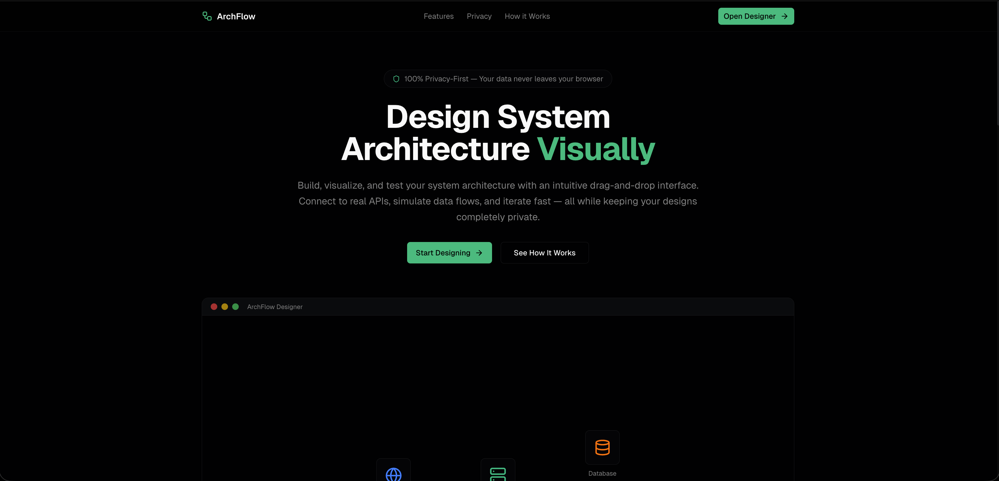

# ArchFlow

> Privacy-first visual workspace for designing, simulating, and sharing system architectures.



ArchFlow lets architects and product teams drag-and-drop cloud components, wire up real API calls, collaborate in real time, and run flow simulations – all without sending any data to external servers. Everything runs in the browser, powered by local-first storage and Liveblocks for sync.

## ✨ Highlights

- **Visual designer** with 25+ pre-built nodes (servers, DBs, queues, clients, etc.)
- **Local-only storage** – diagrams, API keys, and simulation data never leave the browser
- **Real-time collaboration** via Liveblocks rooms, shared cursors, and presence
- **AI assistant** with *Create* and *Understand* modes, including architecture suggestions and diagram critiques
- **Flow simulation** to replay data through the graph, inspect logs, and highlight active nodes
- **Export/Import** to PNG, SVG, and JSON for versioning or handoff

## 🧱 Tech Stack

- [Next.js 16](https://nextjs.org/) with App Router
- [TypeScript](https://www.typescriptlang.org/)
- [Tailwind CSS](https://tailwindcss.com/) + custom components
- [Zustand](https://zustand-demo.pmnd.rs/) for local-first stores
- [Liveblocks](https://liveblocks.io/) for presence and sync
- [@xyflow/react](https://xyflow.com/react/) (React Flow) for the canvas
- [AI SDK](https://sdk.vercel.ai/) + Groq models for the assistant

## 🚀 Getting Started

```bash
pnpm install
pnpm dev
```

Then open [http://localhost:3000](http://localhost:3000).

### Useful Scripts

| Command       | Purpose                          |
| ------------- | -------------------------------- |
| `pnpm dev`    | Run Next.js locally              |
| `pnpm build`  | Production build + type checks   |
| `pnpm start`  | Launch built app                 |
| `pnpm lint`   | ESLint (includes TypeScript)     |

## 📁 Project Structure

```
app/                 # Next.js routes (landing, designer, API)
components/          # UI + feature components
lib/                 # Stores, utils, engines
public/              # Icons, OG image, assets
styles/              # Tailwind base layers
```

Key files:

- `components/synced-architecture-designer.tsx` – collaborative canvas
- `components/ai-chat-panel.tsx` – AI assistant with chat + tool calls
- `lib/architecture-store.ts` – local state + simulation logic
- `app/api/chat/route.ts` – Groq-backed AI route handler

## 🧠 Roadmap

- [ ] Branch-aware history & versioning
- [ ] Custom component library (upload icons, metadata)
- [ ] Multi-diagram workspaces
- [ ] Infrastructure-as-code export

## 🧑‍💻 Author

- GitHub: [Avik-creator/ArchFlow](https://github.com/Avik-creator/ArchFlow)
- Peerlist: [peerlist.io/avikmukherjee](https://peerlist.io/avikmukherjee)
- X (Twitter): [@avikm744](https://x.com/avikm744)

---

Built with ♥️ to make architecture thinking fast, collaborative, and private.

